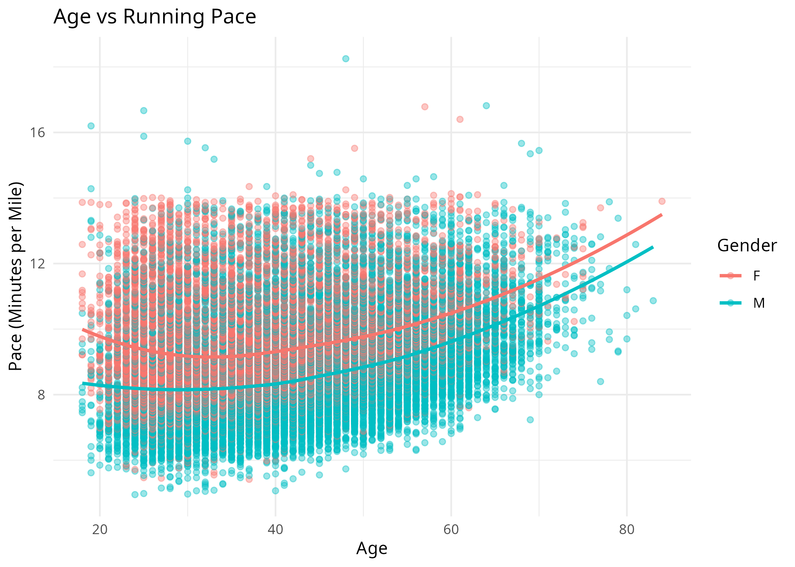
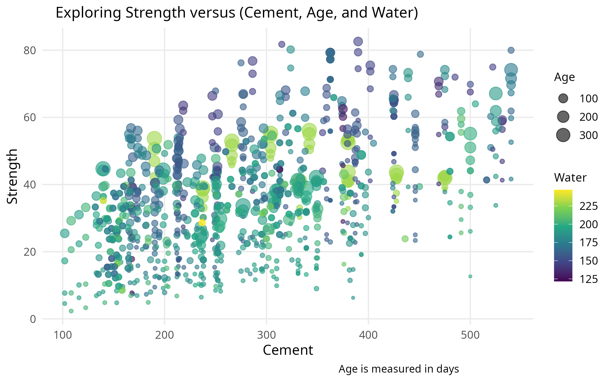

# Data Visualization and Reproducible Research

> Michael Wakefield. 

## Project 01

In this project, I explored _[2017 Boston Marathon data set. Project 1 focused mainly on the demographic and performance of runners by looking at age, finish times, and pace differences.]_ Find the code and report in the `project_01/` folder.

**Sample data visualization:** 

_[Favorite Visualization from this project is the scatter plot that compares age to pace and showing trends across different groups]_

## Project 02

In this project, I explored _[the FIFA 18 player data to understand different relationships between age, rating, potential, and country distribution. In this project there are interactive, spatial, and regression plots. All three of these plots combined really tell a story about player preformance.]_ Find the code and report in the `project_02/` folder.

**Sample data visualization:** 

_[Favorite Visualization is the Interactive Plot that is a scatter plot that highlights the players as a reader hovers over a point]_
_**Figure can be seen in the figure folder**_

## Project 03

In this project, I explored _[advanced visualization skills for producing data analysis for weather and material data sets.]_

**Sample data visualization:** 

_[Favorite visualization is the concrete age vs strength plot.]_

### Moving Forward

_Please add here a short reflection on what you learned and what you plan to continue exploring in terms of data visualization, data storytelling, reproducible research, and/or related topics._
